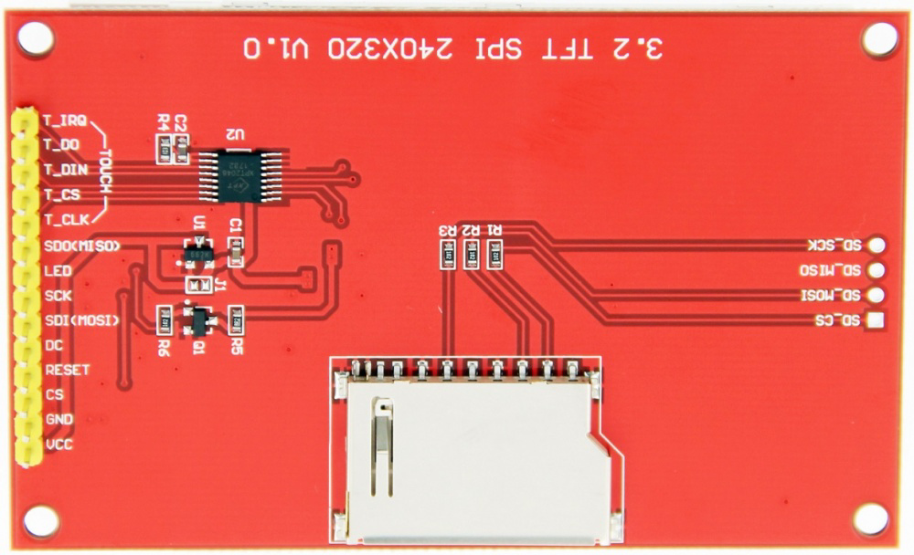
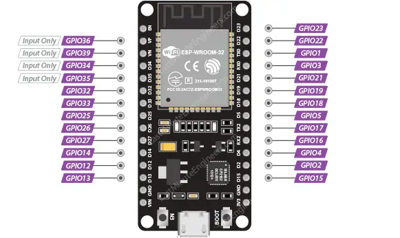

# Game Board Project

> 🚧 This project is currently under development. Features and documentation may change.

This project implements a game board using an ESP32 microcontroller with an ILI9341 LCD display and button controls.

## Setup and Build Commands

```bash
# Upload firmware to device
pio run --target upload

# Clean build files
pio run --target clean

# List available serial ports
ls /dev/tty.*
```

## Hardware Connections

### LCD ILI9341 Display



| Pin name | Target Pin | GPIO |
| -------- | ---------- | ---- |
| Led      | 3.3v       | -    |
| SCK      | D18        | GPIO18 |
| SDI      | D23        | GPIO23 |
| DC       | D2         | GPIO2  |
| Reset    | D4         | GPIO4  |
| CS       | D5         | GPIO5  |
| GND      | GND        | -    |
| VCC      | 3.3v       | -    |



### Button Controls

#### Navigation Buttons
- **Up Button**: D12 (GPIO12)
- **Down Button**: D13 (GPIO13)
- **Action Button**: D14 (GPIO14)

## Development

This project is built using PlatformIO. Make sure you have PlatformIO installed in your development environment before building or uploading the firmware.